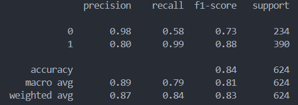

# X-ray Anomaly Detection AI

## Overview

X-rAI leverages advanced Deep Learning techniques such as computer vision and models like VGG16 to identify anomalies in chest X-ray images. The model is trained to detect pneumonia, caused by both bacteria and virus, with high accuracy. It uses Grad-CAM to highlight the regions of anomaly in the X-ray images to aid in interpretation.


## Web Application Demo


*The gif above demonstrates the working of the X-rAI web application once setup is successful.*

## Features

- **Image Upload**: Users can upload chest X-ray images for analysis.
- **Grad-CAM Visualization**: Provides visual explanations of detected anomalies using Grad-CAM.
- **Example Images**: Users can select from example X-ray images to see how the model performs without uploading their own data.
- **End-to-End Model**: A complete solution integrating model inference, visualization, and user interaction into a single web application.


## Model Training Summary

The model has been trained and evaluated with the following performance metrics:

- **Precision (Normal Class)**: 0.98
- **Precision (Pneumonia Class)**: 0.80
- **Overall Accuracy**: 0.84



*The image above illustrates the key stages and metrics of the model training process.*


## Getting Started

### Prerequisites

- Python 3.9.10
- requirements.txt (as included in the repository)

### Installation Guide (to run on local machine)

1. **Clone the repository**

    ```bash
    git clone https://github.com/your-username/X-rAI.git
    cd X-rAI
    ```

2. **Create a virtual environment and activate it** (It is advised to use an environment for smooth functioning)

    ```bash
    python -m venv venv
    source venv/bin/activate  # On Windows use `venv\Scripts\activate`
    ```

3. **Install the required packages**

    ```bash
    pip install -r requirements.txt
    ```

4. **Run the application**

    ```bash
    python app.py
    ```

    The application will be available at `http://127.0.0.1:5000`.

## Repository Structure

- `app.py`: Main Flask application file.
- `static/`: Contains static files like CSS, images, and uploaded files.
  - `styles.css`: CSS file for styling the application.
  - `uploads/`: Directory for storing uploaded images.
  - `inference_gradcam/`: Directory for storing gradcam inference results.
  - `images/`: Directory for static images like logos.
- `templates/`: Contains HTML templates.
  - `index.html`: Main template file for the application.
- `inference.py`: Contains the code for running Grad-CAM inference.
-  `vgg16_model_weights_10.h5`: Contains weights for the trained VGG16 model 

## Usage

1. **Upload a Chest X-Ray Image**: Use the upload form to submit your X-ray image for analysis.
2. **View Results**: The application will display the original image along with the Grad-CAM visualization of detected anomalies.
3. **Example Images**: Select from predefined example images to see the model's performance on known cases.

## End-to-End Model

Our application provides a complete end-to-end solution:
- **Image Input**: Users upload or select images.
- **Inference**: The uploaded or selected image is processed using the trained model.
- **Visualization**: Grad-CAM visualizations are generated to highlight regions of interest.
- **Results Display**: Results are presented in a user-friendly interface, showing both the original and Grad-CAM images.

## References
[Chest X-Ray Pneumonia Dataset](https://www.kaggle.com/datasets/paultimothymooney/chest-xray-pneumonia)


